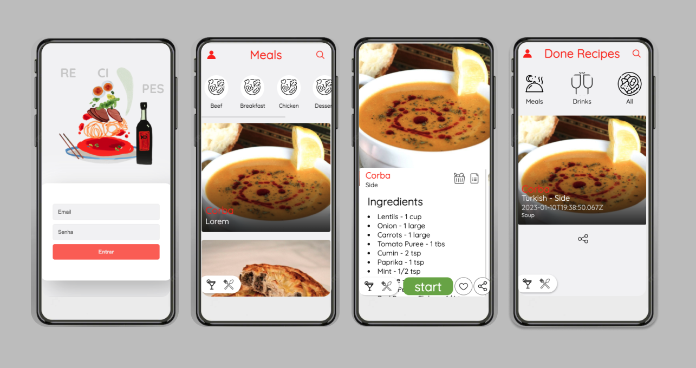

# Recipes #


In this project, a responsive recipe app was developed, using two important React features: Hooks and Context API. In this app it is possible to log in with user data, view, search, filter, favorite and follow the progress of preparing food and drink recipes! The databases used come from 2 different APIs, one for food and one for drinks. About 90% of the application has been tested using Jest library.

## Guidelines to runnig API ##
1. Clone the repository: ```git clone git@github.com:carinacunha/recipes-app.git```
2. Navigate to the root of the repository: ```cd recipes-app```
3. Install the dependencies: ```npm install```
4. Start the app: ```npm start```

** This project was developed during the Full Stack Web Development course at Trybe.**
